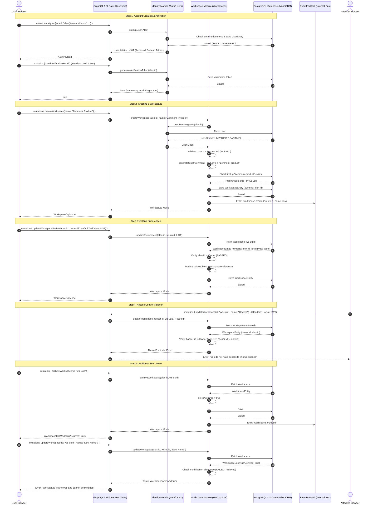

# FlowBoard: Identity & Workspace Integration Dry-Run

This document outlines all the features present in the **Identity** and **Workspace** modules and walks through a complete end-to-end dry-run representing a real user's workflow.

---

## 1. Feature Registry

### Identity Module
| Feature | API Action (GraphQL) | Domain/Business Rule |
| :--- | :--- | :--- |
| **User Signup** | `signup(input)` | Registers new unverified user. Hashes password. |
| **User Login** | `login(input)` | Validates credentials, generates JWTs, creates a session. |
| **Verify Email** | `sendVerificationEmail` | Sends/generates email verification token. |
| **Profile Update** | `updateProfile(input)` | Updates display name and timezone. |
| **Session Control** | `activeSessions`, `revokeSession(id)` | Lists all devices logged in; allows single session revocation. |
| **Global Logout** | `logoutAllDevices` | Revokes all active user tokens & sessions. |
| **Reset Password** | `forgotPassword`, `resetPassword` | Requests password reset link, updates hash securely. |

### Workspace Module
| Feature | API Action (GraphQL) | Domain/Business Rule |
| :--- | :--- | :--- |
| **Create Workspace** | `createWorkspace(input)` | Auto-generates unique slug. Blocks suspended users. Creator becomes Owner. Emits `WorkspaceCreatedEvent`. |
| **Update Details** | `updateWorkspace(id, input)` | Updates name (regenerates slug), logo, description. Blocks non-owners. |
| **Update Preferences** | `updateWorkspacePreferences(id, input)` | Adjusts default task view (`BOARD`/`LIST`/`CALENDAR`) and default timezone. |
| **Archive Workspace** | `archiveWorkspace(id)` | Places workspace in read-only state. Modifying archived workspaces throws error. |
| **Restore Workspace** | `restoreWorkspace(id)` | Unlocks archived workspace. |
| **Soft Delete** | `deleteWorkspace(id)` | Marks workspace as deleted. Excludes it from standard fetches. |
| **List Workspaces** | `myWorkspaces` | Returns all active workspaces where current user is the owner. |

---

## 2. End-to-End User Flow Sequence

The following diagram illustrates how the **Identity** and **Workspace** modules interact through a single user's journey.



---

## 3. Dry-Run Execution Scripts (GQL Playground / Apollo Sandbox)

Below are the exact GraphQL commands you can execute in your local Apollo playground (`http://localhost:3000/graphql`) to run through this dry-run step-by-step.

### 1. Signup & Acquire Tokens
```graphql
mutation Signup {
  signup(input: {
    email: "alex@zenmonk.com",
    displayName: "Alex",
    password: "SecurePassword123"
  }) {
    accessToken
    refreshToken
    user {
      id
      email
      displayName
      accountStatus
    }
  }
}
```

### 2. Verify Session Creation
*(Ensure to set your HTTP headers: `Authorization: Bearer <accessToken>`)*
```graphql
query VerifyMeAndSessions {
  me {
    id
    email
    accountStatus
  }
  activeSessions {
    id
    ipAddress
    userAgent
    createdAt
  }
}
```

### 3. Create a Workspace
```graphql
mutation CreateWorkspace {
  createWorkspace(input: {
    name: "Zenmonk Team",
    description: "FlowBoard project planning and development workspace.",
    timezone: "America/New_York"
  }) {
    id
    name
    slug
    ownerId
    preferences {
      defaultTaskView
      defaultTimezone
    }
  }
}
```

### 4. Update Workspace Preferences
```graphql
mutation UpdatePreferences($workspaceId: ID!) {
  updateWorkspacePreferences(
    id: $workspaceId,
    input: {
      defaultTaskView: LIST
      defaultTimezone: "UTC"
    }
  ) {
    id
    preferences {
      defaultTaskView
      defaultTimezone
    }
  }
}
```

### 5. Test Access Denied
*(Change header to another user's token or remove authorization header, then run)*
```graphql
mutation TryHackingWorkspace($workspaceId: ID!) {
  updateWorkspace(
    id: $workspaceId,
    input: {
      name: "Malicious Rename"
    }
  ) {
    id
    name
  }
}
```
*Expected Response:*
```json
{
  "errors": [
    {
      "message": "You do not have access to this workspace",
      "extensions": {
        "code": "FORBIDDEN"
      }
    }
  ]
}
```

---

## 4. Membership Module Dry-Run

This flow verifies the Membership module's owner creation, invitations, role changes, ownership transfer, and last-owner protections.

### 1. User Signs Up
```graphql
mutation SignupOwner {
  signup(input: {
    email: "owner@zenmonk.com",
    displayName: "Owner",
    password: "SecurePassword123"
  }) {
    accessToken
    user { id email }
  }
}
```

### 2. User Creates Workspace
```graphql
mutation CreateMembershipWorkspace {
  createWorkspace(input: { name: "Membership Dry Run" }) {
    id
    name
    ownerId
  }
}
```

### 3. Membership Creates OWNER From WorkspaceCreatedEvent
```graphql
query WorkspaceMembers($workspaceId: ID!) {
  workspaceMembers(workspaceId: $workspaceId) {
    userId
    role
    joinedAt
    user { email displayName }
  }
}
```
Expected: the creator appears with role `OWNER`.

### 4. Owner Invites Another User
```graphql
mutation InviteMember($workspaceId: ID!) {
  inviteWorkspaceMember(input: {
    workspaceId: $workspaceId,
    email: "member@zenmonk.com",
    role: MEMBER
  }) {
    id
    email
    role
    status
    token
    expiresAt
  }
}
```

### 5. Invited User Accepts Invitation
Sign up or log in as `member@zenmonk.com`, then run:
```graphql
mutation AcceptInvitation($token: String!) {
  acceptWorkspaceInvitation(token: $token) {
    workspaceId
    userId
    role
  }
}
```

### 6. Owner Promotes Member To ADMIN
```graphql
mutation PromoteMember($workspaceId: ID!, $memberUserId: ID!) {
  changeWorkspaceMemberRole(input: {
    workspaceId: $workspaceId,
    userId: $memberUserId,
    role: ADMIN
  }) {
    userId
    role
  }
}
```

### 7. ADMIN Invites Another MEMBER
Log in as the promoted admin, then run:
```graphql
mutation AdminInvite($workspaceId: ID!) {
  inviteWorkspaceMember(input: {
    workspaceId: $workspaceId,
    email: "teammate@zenmonk.com",
    role: MEMBER
  }) {
    email
    role
    status
  }
}
```

### 8. MEMBER Fails To Invite Someone
Log in as a plain member and run:
```graphql
mutation MemberCannotInvite($workspaceId: ID!) {
  inviteWorkspaceMember(input: {
    workspaceId: $workspaceId,
    email: "blocked@zenmonk.com",
    role: MEMBER
  }) {
    id
  }
}
```
Expected: `INSUFFICIENT_WORKSPACE_PERMISSION`.

### 9. OWNER Transfers Ownership
```graphql
mutation TransferOwnership($workspaceId: ID!, $adminUserId: ID!) {
  transferWorkspaceOwnership(input: {
    workspaceId: $workspaceId,
    targetUserId: $adminUserId
  }) {
    userId
    role
  }
}
```
Expected: the target member becomes `OWNER`; the previous owner becomes `ADMIN`.

### 10. Last OWNER Cannot Leave Or Remove Themselves
Log in as the only owner, then run:
```graphql
mutation LastOwnerCannotLeave($workspaceId: ID!) {
  leaveWorkspace(workspaceId: $workspaceId)
}
```
Expected: `CANNOT_LEAVE_AS_LAST_OWNER`.

Attempting to remove the only owner through `removeWorkspaceMember` is also blocked by the last-owner rule.

### 6. Archive and Test Modification Lock
```graphql
mutation Archive($workspaceId: ID!) {
  archiveWorkspace(id: $workspaceId) {
    id
    isArchived
  }
}
```
*(Now try to update it again)*
```graphql
mutation UpdateArchived($workspaceId: ID!) {
  updateWorkspace(
    id: $workspaceId,
    input: {
      description: "Trying to modify archived workspace"
    }
  ) {
    id
  }
}
```
*Expected Response:*
```json
{
  "errors": [
    {
      "message": "Workspace \"ws-uuid\" is archived and cannot be modified",
      "extensions": {
        "code": "WORKSPACE_ARCHIVED"
      }
    }
  ]
}
```
